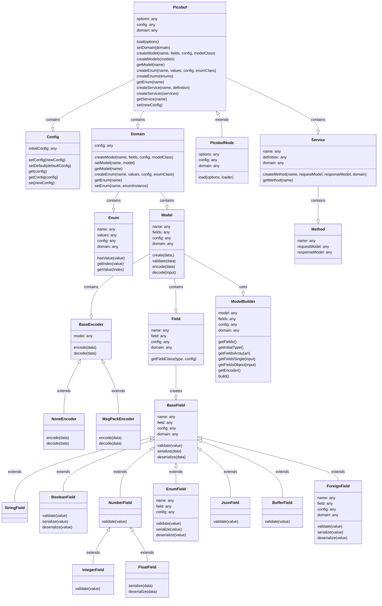

```mermaid
classDiagram
class Config {
  initialConfig: any
  setConfig(newConfig)
  setDefault(defaultConfig)
  get(config)
  getConfig(config)
  set(newConfig)
}
class Domain {
  config: any
  createModel(name, fields, config, modelClass)
  setModel(name, model)
  getModel(name)
  createEnum(name, values, config, enumClass)
  getEnum(name)
  setEnum(name, enumInstance)
}
class BaseEncoder {
  model: any
  encode(data)
  decode(data)
}
class NoneEncoder {
  encode(data)
  decode(data)
}
class MsgPackEncoder {
  encode(data)
  decode(data)
}
class Enum {
  name: any
  values: any
  config: any
  domain: any
  hasValue(value)
  getIndex(value)
  getValue(index)
}
class Field {
  name: any
  field: any
  config: any
  domain: any
  getFieldClass(type, config)
}
class BaseField {
  name: any
  field: any
  config: any
  domain: any
  validate(value)
  serialize(data)
  deserialize(data)
}
class StringField
class BooleanField {
  validate(value)
  serialize(value)
  deserialize(value)
}
class NumberField {
  validate(value)
}
class IntegerField {
  validate(value)
}
class FloatField {
  serialize(data)
  deserialize(data)
}
class EnumField {
  name: any
  field: any
  config: any
  validate(value)
  serialize(value)
  deserialize(value)
}
class JsonField {
  validate(value)
}
class BufferField {
  validate(value)
}
class ForeignField {
  name: any
  field: any
  config: any
  domain: any
  validate(value)
  serialize(value)
  deserialize(value)
}
class ModelBuilder {
  model: any
  fields: any
  config: any
  domain: any
  getFields()
  getInitialType()
  getFieldsArray(arr)
  getFieldsSingle(input)
  getFieldsObject(input)
  getEncoder()
  build()
}
class Model {
  name: any
  fields: any
  config: any
  domain: any
  create(data, )
  validate(data)
  encode(data)
  decode(input)
}
class PicobufNode {
  options: any
  config: any
  domain: any
  load(options, loader)
}
class Picobuf {
  options: any
  config: any
  domain: any
  load(options)
  setDomain(domain)
  createModel(name, fields, config, modelClass)
  createModels(models)
  getModel(name)
  createEnum(name, values, config, enumClass)
  createEnums(enums)
  getEnum(name)
  createService(name, definition)
  createServices(services)
  getService(name)
  set(newConfig)
}
class Method {
  name: any
  requestModel: any
  responseModel: any
}
class Service {
  name: any
  definition: any
  domain: any
  createMethod(name, requestModel, responseModel, domain)
  getMethod(name)
}

Picobuf --|> Domain : contains
Picobuf --|> Config : contains
Field --|> BaseField : creates
Model --|> ModelBuilder : uses
Picobuf --|> Service : contains
Service --|> Method : contains
Domain --|> Model : contains
Domain --|> Enum : contains
Model --|> Field : contains
Model --|> BaseEncoder : contains
BaseEncoder <|-- NoneEncoder : extends
BaseEncoder <|-- MsgPackEncoder : extends
BaseField <|-- StringField : extends
BaseField <|-- BooleanField : extends
BaseField <|-- NumberField : extends
NumberField <|-- IntegerField : extends
NumberField <|-- FloatField : extends
BaseField <|-- EnumField : extends
BaseField <|-- JsonField : extends
BaseField <|-- BufferField : extends
BaseField <|-- ForeignField : extends
Picobuf <|-- PicobufNode : extends
```
